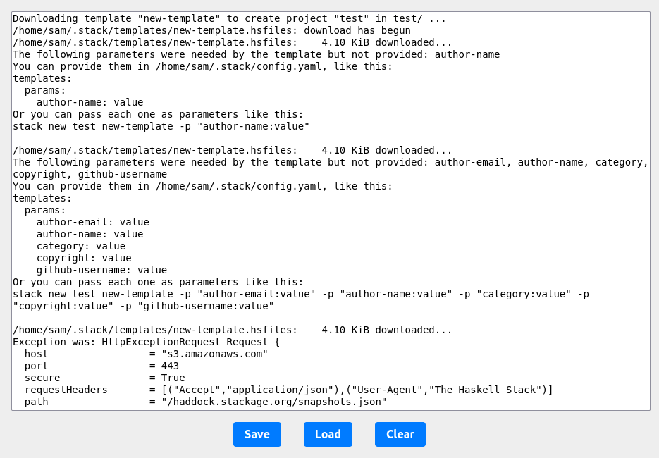

## Overview

  

This server allows the user to quickly share arbitrarily formatted text between
computers via a web interface. Simply paste your text in to the text box, click
"Save", and access the server from another computer.

## Features

- A simple, intuitive design, to ward off the complexity demon.
- Enables simple, human-centered data transfer between computers.
- No dependencies besides the Go standard library.
- A simple to use control panel with Save, Reload, Clear, and Copy buttons.
- In-browser editing of snippets.

## Setup

1. Ensure Go is installed
2. Run `go build .` in the same directory as the `go.mod` file.
3. Start the server with `./snippet-server`.

The default port is 38642. If you want to change it, simply modify the relevant
lines in `main.go`. I do not want to expose this as an argument because I want
the app to be as simple as possible.

## Usage

Simply navigate to the app in your browser, paste in the text you want to share,
and click "Save". The text can be retrieved on the other side by loading the
page, or clicking the "Reload" button.

## License

This work is licensed under the GNU General Public License version 3 (GPLv3).

